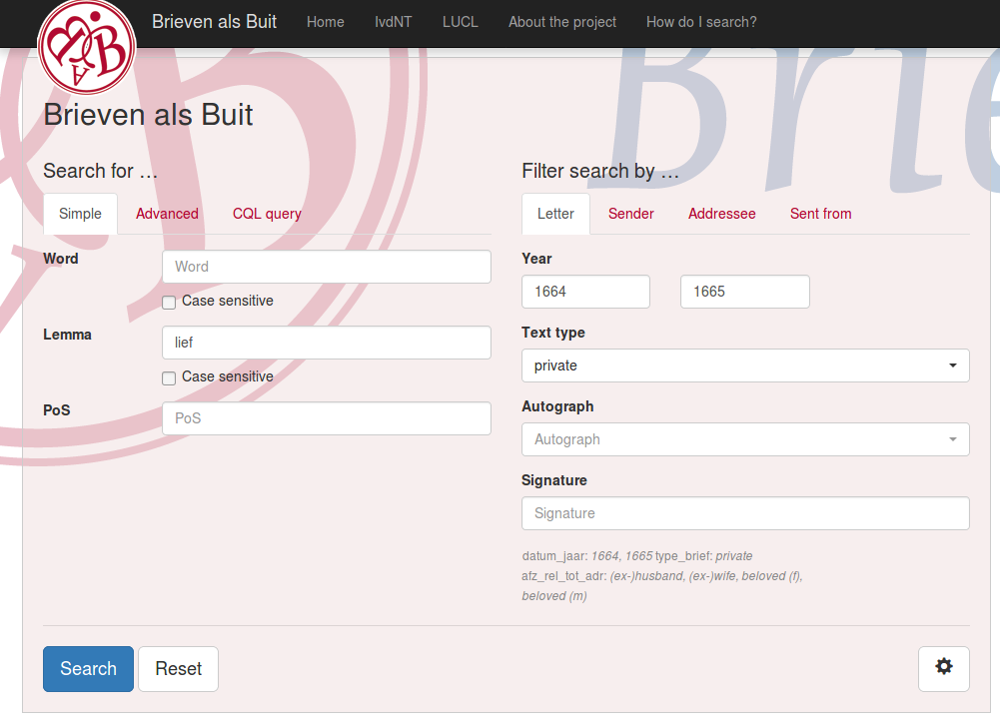

class: title
.box[

# Inside Information
## Corpus search with BlackLab
Jan Niestadt<br/>
main BlackLab developer
]

???
The title of this presentation is Inside Information, and as you may or may not recall, it is in this chapter of The Hobbit that Bilbo first enters the mountain and encounters Smaug the Dragon.

So let's venture into the mountain and see what we find...

---
class: image, nologo, dark
<!-- # A foul beast slumbers under the mountain... -->
# You hear the gurgling noise of some vast animal snoring in its sleep...

???
A monstrous beast is snoring nearby. Let's be brave and see if we can get a glimpse...

--


???
It's more horrible than I could have imagined. Let's see what we can find out about this terrifying creature.

---
class: chaptertitle

# BlackLab
## A powerful “word pattern retriever”
### (a.k.a. corpus search system)

???
BlackLab is a way to search and analyze corpora, large collections of text. We can use it to quickly "sniff out" word patterns we're looking for in large text collections.

---
# What can it sniff out?

- sequences of words
- match by annotation<br/>(e.g. word, lemma, part of speech)
- parts of words<br/>(using regular expressions)
- optional parts (e.g. optional preposition)
- repetitions (e.g. one or more adjectives)
- words in specific XML elements
- frequency lists using all of the above

???
BlackLab can help you find sequences of words, where each word match may use a different annotation such as word, lemma (or head word) or part of speech. So you could look for an adjective followed by a a form of the word 'hobbit'.

You can also match parts of a word or lemma, your query can include optional parts and repetitions (such as one or more adjectives), and you can even do simple matches based on XML elements.

And finally, if you use these to match several different phrases, you can easily get a frequency list, so you get a quick overview of how often each phrase occurs. I will give some examples later.

If you want to use all these powerful pattern matching features, you will have to learn Corpus Query Language (or CQL), which is a standard in the corpus search world. It's not too difficult, especially if you're already familiar with the concept of regular expressions. Of course, you don't have to learn CQL right away if you just want to perform some simple searches. I will show you in a minute.

---
# What can we feed the beast?

- Supports multiple formats (TEI, FoLiA, …)
- Add your own format using simple text file **(NEW!)**
- XML and non-XML formats supported
- Full Unicode supported

???
An important question you might be asking is: can BlackLab handle my data format? The likely answer is YES. It supports a number of common formats out of the box, and we've recently made it much easier to add support for new formats. If you have data in a format that's not supported yet, be it an XML format or a comma-separated or tab-separated file, you can write a simple configuration file to add support for your format. There's documentation on how to do this, and if you have any trouble, we'll be happy to work with you to get it sorted out.

It's also nice to know that BlackLab has no problem with special characters or different scripts; it supports all of Unicode. I've seen it used with Chechen, Japanese and Hindi corpora.

Okay, so I've briefly shown how we can search and how flexible it is with regards to input data. But maybe you're wondering: how do I actually use it?

---
class: image, nologo
# It has three heads!


???
Well, there's three main "flavours" or "levels" of BlackLab you could say, each of which are suited to a different group of users.

---
# It has three heads!

- **AutoSearch (BETA)**<br/>
  *(web application)*<br/>
  quickly upload &amp; search some data
- **Server**<br/>
  *(web service)*<br/>
  easily use it from your favourite language
- **Core**<br/>
  *(Java API)*<br/>
  wield all its power from Java

???
For the least-technical users, or for people who just want to quickly try something out, we have AutoSearch. This is a web application that can be configured as a static corpus search application, or configured to allow each user to upload their own data, which will automatically be indexed by BlackLab and be ready to search. More on this in a moment.

For computational linguists and developers who want to use BlackLab to analyze a corpus, or develop an application, there's BlackLab Server. This is a web service and can easily be used from any programming language.

Finally, if you really want full control over all of BlackLab's features, and you're comfortable in Java, there's also a Java API you can use directly.

---
# BlackLab Core

- Clean API; examples available
- Based on Apache Lucene
- Most fine control over features
- Some additional features
- *Scariest head, but no match for Java wizards*

???
Let's quickly look at the Java API. It's fairly clean and there's examples of how to use it. It is based on the popular and mature text search engine Apache Lucene. It supports a few less commonly used features that are not available through the web service yet, such as capturing multiple specific parts of your query for each hit.

It's definitely the most advanced way of using BlackLab. It shouldn't be a problem for a competent developer, but it's also not usually necessary. I would recommend most people use BlackLab Server or AutoSearch.

---
# BlackLab Server

- RESTful webservice; speaks XML/JSON
- Easy to use from any programming language
- From quick scripts to complex applications
- Takes care of multi-user, caching, paging, etc.
<!-- - Stateless, so just add servers to scale with demand -->
- *A powerful head, but easily subdued by many*

???
Let's look at BlackLab Server next. Don't worry if this is a bit too technical for your taste, I will quickly go over this and then show what you can accomplish in AutoSearch, which is a great place to get your feet wet and play around with the possibilities.

BlackLab Server is just a REST web service, and it can reply with either XML or JSON, whichever you prefer. Like any web service, you can use it from any programming language, for example Python or R. We use it as the basis for AutoSearch ourselves. It's also nice to use in a script if you want to answer some question that cannot easily be done using AutoSearch.

So this is already more accessible than the Java API. Anyone with a little experience in any programming language can use this. And if you do get stuck, you can always ask, I'll be happy to help if I can.

---
# BlackLab AutoSearch

- Web-based corpus search application
- Used at INT for e.g. Modern Dutch Corpus
- Different levels of search interface
- Search part of the corpus (filter on metadata)
- Grouping, sorting (including on context words)
- Upload and index your own corpora
- *Mild-mannered, cuddly head; loves treats*

???
Finally, let's see what AutoSearch is all about. It's a web-based corpus search application, the same one we use at the INT for publishing our corpora, such as the Modern Dutch Corpus.

It features three 'difficulty levels' of search interface, so users can work with it no matter their experience. It allows filtering on metadata so you can search the part of the corpus you're interested in. It allows grouping and sorting on various properties, including contextual ones such as the text matched, or the word to the left of the match.

Fairly recently, we've added the ability to upload and index your own corpora. A very basic version of this is online now in our CLARIN portal, but we're working on a much improved version.

---
class: chaptertitle
# BlackLab AutoSearch
## (web application)

???
So let's dive in and see everything that AutoSearch has to offer.

---

class: image, nologo
# Simple search


???
There's a simple search, for people who just want to look up a word. In this search, you don't have to know about regular expressions, but you can use the wildcards asterisk and question mark. These work the same as in file systems.

On the right, you can see the metadata interface. This adapts to the metadata in the current corpus and as you can see, it's tabbed. This corpus is based on old letters, and the first tab here shows fields related to the letter, such as the year it was sent.

---

class: image, nologo
# Metadata tabs


???
The second tab shows fields related to the sender, and so on.

---

class: image, nologo
# Concordances (KWIC view)


???
If you perform a simple search on the lemma 'lief', you will get a list of concordances as a result: an overview of the keyword-in-context (also called a KWIC view).

---

class: image, nologo
# View document


???
You can click on a document title to view the document.
Here you can see the document metadata.

---

class: image, nologo
# View document


???
And here you can see the full document content. This feature is only available if the corpus metadata allows it.

---

class: image, nologo
# Concordances (KWIC view)


???
If we go back to our KWIC view, you can see there's many different forms of the word 'lief': inflections and spelling variations. What if we want to know how often each occurs?

---

class: image, nologo
# Group by matched word


???
Well, we can group the result set by words matched and we will get a frequency list like this that shows us what are the more common and less common variants. We can even click on individual bars to see the group of matches it represents.

---

class: image, nologo
# Group by matched PoS


???
We can also group on a different criterium. Let's say we want to know the part of speech of the matched word. That produces this much smaller bar graph, and we can see that most of our matches are adjectives, but some are nouns as well.

---

class: image, nologo
# Simple search


???
Let's have a look at the different levels of search. This again is the simple search, for looking up a simple word or phrase.

---

class: image, nologo
# Advanced search: query builder


???
If you want to access more of the available features, but aren't yet comfortable with CQL, the Advanced tab brings you to the query builder interface. Here you can add tokens, add criteria to tokens, combine criteria with AND and OR, set repetitions for tokens, etc.

This query builder was inspired by the one seen in the Swedish Korp interface.

---

class: image, nologo
# Expert: enter CQL query


???
Finally, for people like me, who prefer to type in Corpus Query Language directly, there's the Expert interface. Here you can create queries as complicated as you want.

Maybe it would be nice to have a quick primer or refresher on Corpus Query Language.

---
# Corpus Query Language 1

Examples of Corpus Query Language patterns:

- `[word="the"] [word="gr.*"]`

  → “the ground, “the great, …
  >(equivalent: `"the" "gr.*"`)

- `[lemma="see"] [] [pos="NOU"]`

  → “sees a mountain”, “saw some trees”, …

- `[pos="ADJ"]+ [pos="NOU"]`

  → “roast mutton”, “small slimy creature”, …

???
Let's look at some example CQL queries.

The first query searches for a two-word phrase where the first word is "the" and the second word starts with "dwar", so it would match "the ground", "the great", et cetera. There's actually an abbreviated way of writing this query because we're using the word annotation.

If you're familiar with regular expressions, you will recognize "dot asterisk" to mean "any character, zero or more times".

The second query searches for a three-word phrase, where the first word is a form of the lemma "see" and the third word is a noun. The middle word contains no filter expressions and can therefore be any word. So this would match "sees a mountain", "saw some orcs", et cetera.

The third query looks for nouns preceded by one or more adjectives. As you can see, the "plus" operator here applies to the "adjective" token. So in addition to specifying a token filter using a regular expression, we can actually use regular expression operators like plus, asterisk or question mark on the tokens themselves.

---
# Corpus Query Language 2

- `("big"|"huge")+ ("beast"|"treasure")`

  → “big huge beast, “huge big treasure”, …

- `A:[] "and" B:[] :: A.word = B.word`

  → “more and more”, “on and on”, …

???
Here's two more complicated examples.

The first introduces the pipe operator, which means "or", and the use of parens to group part of the query. So this reads as "one or more occurrences of the word big or huge; followed by one occurrence of beast or treasure.

The second query shows us global constraints, which can sometimes be handy to express relations between tokens. The basic query is everything before the "double colon" operator, and as you can see, we can "tag" tokens by prefixing them with a label and a colon, so we've tagged the gfirst token as A and the third token as B. Then after the "double colon" or "global constraint" operator, we specify that A and B must be the same word. So this would match "more and more", "on and one", et cetera.

---
# Corpus Query Language 3

CQL includes basic XML element matching:

- `"that" "there" within <s/>`<br/>

  “that there” within a single sentence.

- `<ne type="PERS"/> containing "the" "great"`<br/>

  named entities referring to a person, containing the words “the great”.

- `"once" "more" </s>`

  sentences ending in “once more”.

???
Corpus Query Language allows for some basic searching of XML elements. It is important to note that it's not nearly as powerful as something like XPath; CQL's main focus is patterns of words, not higher-level structures such as grammatical and semantic annotations. But that is something we'd like to expand upon in the future.

The first example here simply looks for a phrase within a sentence, making sure you don't match a sentence ending in "that" and another sentence starting with "there".

The second example looks for named entities that contain the phrase "the great", and as you can see, it filter on the attribute of the ne tag so we only find persons.

The third example looks for the phrase "once more" at the end of a sentence.

So that's CQL. If you want to learn more about it, have a look at the BlackLab project site.

---

class: image, nologo
# Create your own corpus


???

Like I said before, a recent addition is the ability for users to upload their own data to search. This is the easiest way to try setting up a small corpus with BlackLab.

Right now we have a limited version of this available that can handle FoLiA and TEI, but we're working on a much improved version that not only can handle almost any format you throw at it; it should actually be possible to upload plain text or Word documents and have them tagged automatically and made searchable.

---

class: image, nologo
# Create your own corpus


???
Here's the list of formats we will support out-of-the-box, and this list will probably grow.

---

class: image, nologo
# Create your own corpus


???
And here's a very early version of the interface to create your own custom format configuration. We're working on a friendlier, more visual interface for this as well.

---
class: chaptertitle
# BlackLab Server
## (web service)

???
So, now that we know all about AutoSearch, let's have a closer look at the engine that powers it all: BlackLab Server. Like I explained before, this is a web service that you can use to build full applications but is also great for quick analysis scripts.

Let's look at what BlackLab Server can do for you.

---
# BlackLab Server 1

What corpora are available?
>`/blacklab-server/`

Information about *Brieven als Buit* (*Letters as Loot*) corpus:
>`/blacklab-server/zeebrieven/`

???
So these are probably the first thing you would ask BlackLab Server.

The first URL actually shows all the corpora available on a BlackLab Server node. The second tells you more about one of the corpora mentioned in the response to the first URL, such as what annotations are available (e.g. word, lemma, PoS) and what metadata fields (e.g. author, title, etc.)

You can either type these in the browser or fetch them from a script, of course. AutoSearch uses this information to generate the user interface, for example.

---
# BlackLab Server 2

Documents in the *Brieven als Buit* (*Letters as Loot*) corpus:
>`/bls/zeebrieven/docs/`

Filter by author:
>`/bls/zeebrieven/docs/?filter=afz_naam_norm:visser`

Find hits by lemma:
>`/bls/zeebrieven/hits/?patt=[lemma="schip"]`

???
So when you know the corpus you want to query, this is how you could proceed. The first URL here simply returns a list of all documents in the corpus, along with their metadata values. Actually, it won't return the full list, just the first page, and you can fetch subsequent pages if you want.

The second URL filters this list by author. You can filter it by any metadata field, of course.

The third shows us how to execute a CQL query. Of course, the CQL query should be URL-encoded if you're doing this, but that would make for an ugly, unreadable slide, and it's easy to do in any programming language.

---

# BlackLab Server 3

Refer to a document by its persistent ID.

Document information:
>`/bls/zeebrieven/docs/12345`

Full document (if allowed):
>`/bls/zeebrieven/docs/12345/contents`

With highlighting:
>`/bls/zeebrieven/docs/12345/contents?patt=[lemma="schip"]`

???
Here's how you would fetch a specific document's metadata and contents. Note that contents can only be retrieved if allowed by the corpus metadata.

The third example shows how you can highlight a pattern in the full contents.

---
class: chaptertitle
# Using BlackLab Server from script

???
I mentioned that BlackLab Server is useful for analysis scripts. I'll give a few quick examples in R and Python.

---
class: nologo

# Concordances using R

```r
suppressMessages(library("RCurl"))
suppressMessages(library("rjson"))

# Convert word array to string.
words <- function(context) {
    return(paste(context[['word']], collapse=" "))
}

# Search and show hits.
search <- function(cqlQuery) {
    url <- paste("http://opensonar.ato.inl.nl/blacklab-server/zeebrieven/hits?patt=", 
         curlEscape(cqlQuery), "&outputformat=json", sep="")
    lines <- suppressWarnings(readLines(url))  # suppress "Incomplete final line"
    response <- fromJSON(paste(lines, collapse=""))
    docs <- response[['docInfos']]
    hits <- response[['hits']]
    for(hit in hits) {
       # Add the document title and the hit information
       doc <- docs[[ hit[['docPid']] ]];
       cat(paste(words(hit[['left']]),
          " [", words(hit[['match']]), "] ", words(hit[['right']]),
          " (", doc[['title']], ")\n", sep="", collapse="\n"))
    }
    return()
}
invisible(search('[pos="PRN"] "schip"'))
```

???
If you're familiar with the R language, here's how to use BlackLab Server to fetch concordances for a CQL query. The search function basically builds a URL, fetches it, parses the JSON data returned, and iterates over the hits to show them.

---
class: nologo

# Concordances using Python

```python
import urllib.parse
import urllib.request
import json

# Convert word array to string.
def words(context):
    return " ".join(context['word'])

# Search and show hits.
def search(cqlQuery):
    url = "http://opensonar.ato.inl.nl/blacklab-server/zeebrieven/hits?patt=" + \
        urllib.parse.quote_plus(cqlQuery) + "&outputformat=json"
    f = urllib.request.urlopen(url)
    response = json.loads(f.read().decode('utf-8'))
    hits = response['hits']
    docs = response['docInfos']
    for hit in hits:
        # Show the document title and hit information
        doc = docs[hit['docPid']]
        print(words(hit['left']) + " [" + words(hit['match']) + "] " + \
            words(hit['right']) + " (" + doc['title'] + ")")

search('[pos="PRN"] "schip"')
```

???
Here's the same script in Python. Looks pretty similar.

Let's see what the output looks like.

---

# Results

.small[
```
      niet becommet voor,  dat schip       Js voo[.] Jn              (To Ietje Jans, 1 augustus 1666)
        kan, dewijl Koert  zijn Schip      reeds vol is              (To Jan Rousman, 28 februari 1780)
           te geraaken, &  deszelfs schip  op de klippen             (To Pieter Vernimmen, 20 november 1780)
            de Groot, was  deszelfs schip  t’eenemaal weg, &         (To Pieter Vernimmen, 20 november 1780)
    Gesteeld woordeen wat  mijn schip      & voolk an                (To Jan Horsman, 18 november 1780)
              om boord op  mijn schip      heft voor de              (To Jan Horsman, 18 november 1780)
   naar nova-Hispanje met  mijn schip      ick hadde gedacht         (To Abraham Quevelerius, 3 januari 1672)
          gaan sullen met  ons schip       soo’t God belieft,        (To unknown, 3 januari 1672)
              late om met  yder schip      dat komt te               (To Barbara Rijkers, 21 januari 1781)
     geschreven heeft van  ul schip        te verkopen en            (To Pieter de Grave, 9 januari 1665)
             sou gij noch  u schip         behouden hier mede        (To Pieter de Grave, 9 januari 1665)
        Jck besorgt wass.  mein schip      soude enige perickel      (To John Rainmorter, 31 november 1666)
        verstaen niet een  eenich schip    uijtmach als oorloogh     (To Laurens Hansz. Rock, 15 maart 1665)
            tot Genua sal  sijn schip      noch vol crijgen          (To Michiel Heusch jr., 8 juni 1664)
     veeberuarij hebt wij  ons schip       verloren ende ick         (To Grietje Pieters, 12 maart 1664)
              want ik met  eijder schip    niet kan schrijve         (To David de Jong, 20 november 1780)
           genomen en heb  ons schip       in de gront               (To Hilletje Hendriks, 28 augustus 1664)
              Om UEd: met  ijder Schip     te Schrijven is           (To Willem van Spall, 12 oktober 1779)
          de Assuranie op  Zyn schip       of op myn                 (To Mietje Hansen, 14 januari 1781)
                dat wy op  zyn schip       hebben Voor myn           (To Mietje Hansen, 19 januari 1781)
           die vlugte met  Zyn schip       was den armen             (To J.D. Praetorius, 2 november 1780)
            aan boord van  Zyn schip       onthalen en Versoekt      (To Jan Steenhuizen, 11 november 1780)
      sorgvuldig was voor  syn schip       en die het                (To Jan Steenhuizen, 11 november 1780)
           onse Natie met  sijn schip      opt St Croix              (To Jan Steenhuizen, 11 november 1780)
                al wel in  ons schip       godt geue dat             (To Marijke Belleman, 8 december 1664)
        overstappen Van t  Eene Schip      opt ander Except          (To Gijsbert Verhaast, 6 december 1780)
                 En ik op  mijn schip      Tot t moment              (To Gijsbert Verhaast, 6 december 1780)
            ken hebbe met  dit schip       geen occasie om           (To unknown, 7 september 1672)
           het soucker jn  sijn schip      heeft en soo              (To Neeltje Andriesen, 15 september 1672)
              heb ik souw  geen schip      onbeswanger van myn       (To Margaretha Berewout-Huurdeman, 30 januari 1781)
        Brengen en macken  dat schip       daer door Preis           (To Arnoud van der Beke, 28 oktober 1666)
          ney touwerck Vt  mein schip      gecomen 5 lb              (To Arnoud van der Beke, 28 oktober 1666)
             om dar weder  ons schip       te herstellen, het        (To Maria Elisabeth Bekker (Mietje), 30 december 1780)
             senden UE pr  dit schip       Capt: jacob soettelinck   (To Andries Claasz. Vos, 12 september 1672)
            wij hebben op  ons schip       de roode loop             (To Wilhelmina Vurens, 12 november 1780)
                                                   ...                          
```
]

???
As you can see, this looks a lot like what AutoSearch returns. I've added a bit of formatting here to line things up nicely.

---

# Frequency lists (grouping)

```python
import urllib.parse
import urllib.request
import json

def group(title, cqlQuery, groupBy):
    url = "http://opensonar.ato.inl.nl/blacklab-server/zeebrieven/hits?group=" + groupBy\
        + "&patt=" + urllib.parse.quote_plus(cqlQuery) + "&outputformat=json"
    f = urllib.request.urlopen(url)
    response = json.loads(f.read().decode('utf-8'))
    groups = response['hitGroups']
    print(title)
    for group in groups[0:10]:
        print ('  %-20s %4d' % (group['identityDisplay'], group['size']))
    print()

group('Spelling variation',       '[lemma="water"]',             "hit:word:i")
group('Starts with schip/scheep', '[word="sch(ee|i)p.*"]',       "hit:word:i")
group('Adjectives for schip',     '[pos="ADJ"] [lemma="schip"]', "hit:lemma:i")
group('Who is sweet (lief)?',     '[lemma="lief"] [pos="NOU"]',  "hit:lemma:i")
```

???
I also showed you how to create frequency lists in AutoSearch by grouping results. Here's how you can do this from a script, plus a few fun examples.

---
# Frequency lists: results

.left[
```
Spelling variation
  water                  79
  waater                 15
  waeter                  8
  water,                  7
  watter                  3
  vater                   2
  waters                  2
  watten                  1
  waeter,                 1
  waater.                 1

Starts with schip/scheep
  schip                 682
  scheepen              204
  schipper              147
  scheepe                49
  schip,                 18
  Scheeps                17
  scheepen,              13
  schiper                 9
  schippr                 7
  scheep                  7
```
]

.right[
```
Adjectives for schip
  ander schip            17
  Hollands schip         15
  naast schip            11
  Engels schip           11
  verscheiden schip      10
  vertrekkend schip       8
  Oost-Indisch schip      6
  eerst schip             5
  Deens schip             5
  voornoemd schip         4

Who is sweet (lief)?
  lief man              258
  lief kind             134
  lief vrouw            117
  lief moeder            62
  lief zoon              56
  lief zuster            49
  lief broeder           39
  lief vader             33
  lief huisvrouw         32
  lief Heer              19
```
]

???
And here's the output of that script.

---
class: chaptertitle
# Present and future

???
To wrap things up, let's quickly see where we stand with BlackLab, and where we'd like to go in the future.

---
# Nature of the beast

- All open source, available on GitHub
- Extensive documentation on project site
- Well-tested; 7 years of development
- Happy users in Netherlands, Belgium, South Africa, USA, Japan, China

???
Everything I've shown here is open source and is documented on the project site, which includes an introduction and guides to accomplish specific tasks. BlackLab has been  developed over 7 years and every version is subjected to hundreds of tests to ensure we don't break it.

I get regular email from users from all over the world, usually happy ones, especially after I help them. Great to see BlackLab being used by people.

---
# Future plans

- Searching for syntactic/semantic relations (treebanks)

- Integration with Solr
  - scaling to larger corpora<br/>(distributed search)
  - improved statistics
  - huge number of Solr plugins available
  - less code to maintain

???
Just because many people are happily using it, doesn't mean there's no improvements to be made. Here are our two top priorities.

First of all, BlackLab is mostly focused on words right now, but we would really like to support searching for syntactic and semantic relations between words and word groups as well. We are working towards making this possible.

Second, we plan to integrate with Solr, the search server built on top of Lucene. This gets us a lot of useful features 'for free', such as scaling to larger corpora by being able to distribute corpora over multiple machines and improved statistics. In addition to this, Solr has a very active ecosystem of plugins available that we might benefit from. Also, relying more on Solr could mean we have less code to maintain ourselves and can focus more on adding useful features to BlackLab.

---
class: image, nologo
# Questions?
.center[]
.bottomright[
<table>
<tr><th>Scripts</th><td>bit.do/blexscripts</td></tr>
<tr><th>Website</th><td>bit.do/blacklab</td></tr>
<tr><th>Code</th><td>github.com/INL/BlackLab</td></tr>
<tr><th>Mail</th><td>jan.niestadt@ivdnt.org</td></tr>
</table>
]